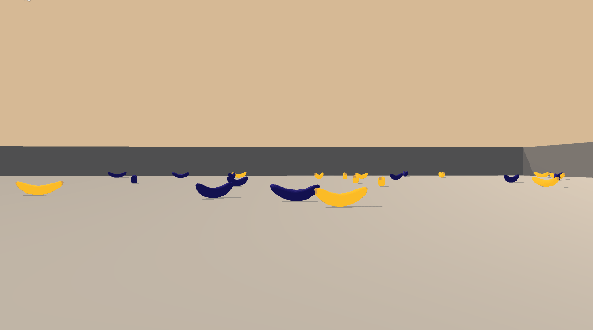

# Deep Reinfocement Learning - Navigation

Training an agent to navigate and collect bananas in a large square world.

## Project Details

TODO

#### Random Agent

#### Trained Agent

TODO

The report clearly describes the learning algorithm, along with the chosen hyperparameters. It also describes the model architectures for any neural networks.

## Getting Started

TODO

The README has instructions for installing dependencies or downloading needed files.

## Instructions

TODO

The README describes how to run the code in the repository, to train the agent. For additional resources on creating READMEs or using Markdown, see here and here.
