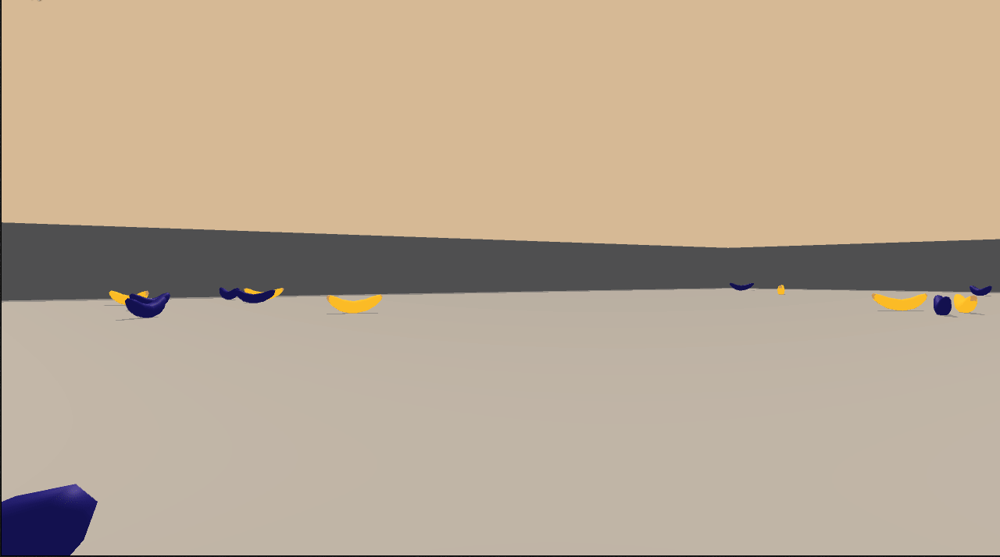

# Deep Reinfocement Learning - Navigation

Training an agent to navigate and collect yellow bananas while avoiding blue bananas in a large square world.

## Project Details

This repository provides an initial implementation - Deep Q-Network algorithm - to train
an agent and solve the Banana Navigation environment.

The task is episodic. A reward of +1 is provided for collecting a yellow banana, and a reward of -1 is provided for collecting a blue banana.

The environment is considered solved if the average score of the last 100 episodes is above 13.0.

Results are below, more details are provided in the [report](https://github.com/daraliu/drl-banana-navigation/blob/master/Report.md).

#### Random Agent


#### Trained simple (fc 64-64) Agent



## Getting Started

The repository contains a Python package `banana-nav` that has command line interface to show
a demo with a trained agent or to use a Random agent.

**Important Notice:**
The DQN agent was trained with using PyTorch 1.4.0 (due to need for CUDA10 to use local GPU). 
However, the version `unityagents` is 0.4.0. Both `pytorch` and `unityagents` packages are required, 
but were omitted from requirements in `setup.py` to prevent installation from PyPi.


## Instructions

The environment should be setup according to instructions in [Udacity DRLND repository](https://github.com/udacity/deep-reinforcement-learning#dependencies).

To train the agent, Linux Unity environment was used. It was provided by Udacity here:

- Linux: [click here](https://s3-us-west-1.amazonaws.com/udacity-drlnd/P1/Banana/Banana_Linux.zip)
- Mac OSX: [click here](https://s3-us-west-1.amazonaws.com/udacity-drlnd/P1/Banana/Banana.app.zip)
- Windows (32-bit): [click here](https://s3-us-west-1.amazonaws.com/udacity-drlnd/P1/Banana/Banana_Windows_x86.zip)
- Windows (64-bit): [click here](https://s3-us-west-1.amazonaws.com/udacity-drlnd/P1/Banana/Banana_Windows_x86_64.zip)

The path to a binary in the extracted environment has to be provided in [Navigation.ipynb](https://github.com/daraliu/drl-banana-navigation/blob/master/notebooks/Navigation.ipynb) Jupyter notebook for training
and as a command line option if using the `banana-nav demo-dqn` command.

### Training

The agent is trained using [Navigation.ipynb](https://github.com/daraliu/drl-banana-navigation/blob/master/notebooks/Navigation.ipynb) Jupyter notebook.

### Demo 

Once the package in installed, `banana-nav` command group becomes available with 
the command `demo-dqn` to run a demo with trained of Random agent.

```
» banana-nav demo-dqn --help                                                                                                                                                                                                                                                            7s 
Usage: banana-nav demo-dqn [OPTIONS] [PATH_WEIGHTS]

  Run a demo of Banana Navigation agent - trained or random (if no weights
  provided)

Options:
  -u, --unity-banana-env FILE  Path to Unity Banana Environment executable.
  --help                       Show this message and exit.

```

Trained model weights located `training_output/baseline/weights.pth` after cloning the repository.
